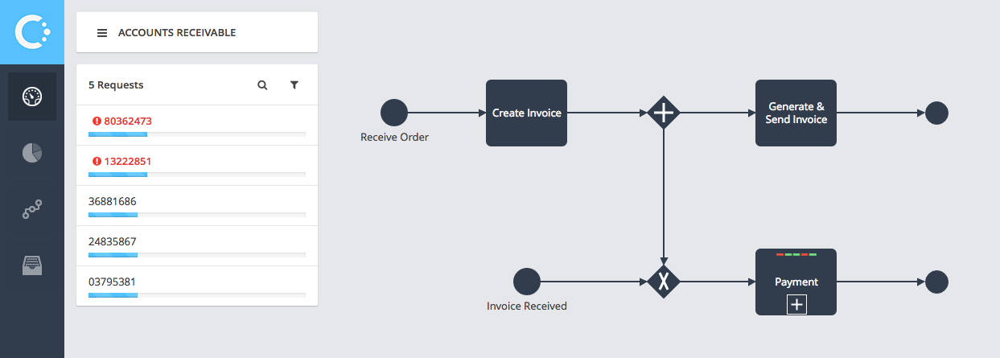

# Cupenya Insights Bluemix Order Entry Example

This example application demonstrates how to use the Cupenya Insights API in a Bluemix application that is based on Node.JS. Specifically it uses the Meteor Framework to develop a simple order entry and management screen. The relevant business activities are logged to Cupenya Insights on Bluemix and then can be analyzed.

# Try It for Free in 1 Minute

To try it out, you need a Bluemix account and then you can deploy us with one click, the necessary services, e.g. Cupenya Insights and a database are created on the fly.


# Instructions

Press Deploy to Blumix button: [](https://bluemix.net/deploy?repository=https://github.com/cupenya/bluemix-order-entry.git)

Notice: In case Deploy to Bluemix is failing; please [follow these steps](#deploy-the-app-using-the-command-line)

Press Log in button and provide your bluemix credentials


Notice: If you are signing in for the first time, you will be asked to create an alias as well.

Press Deploy


Press “View Your App” to be redirected to order-entry app


Create an order in Bluemix App
Hint: Make it a Key account and over 1000 dollars to have a guaranteed dispute.


Return to the Bluemix Dashboard. Scroll down to the “Services” section and click on Cupenya Insights.


Click on "open cupenya insights dashboard"


Select Bluemix Order to Cash - Template


Go to the Editor(1) and click on the settings button(2)


Select connectors tab and Enable the Bluemix Deployment Connector


Press the button "Assign New Connectors", Confirm and press Save.

Map the process tasks such “Create Invoice” to the underlying system. In this example, enable the Bluemix adaptor and link the appropriate event for:
- Create Invoice
- Generate & Send Invoice
- Waiting for Payment
- Handle Dispute

First, click the "Connect System" button.


Then assign the Bluemix connector, set "Complete Event" as Event Mapping and choose the relevant Element Event from the list. An example is shown in the image below.


Important Notice: If event mapping is missing, create data using the order-entry app. 

Repeat the same steps for tasks "Generate & Send Invoice", "Waiting for Payment" and "Handle Dispute" and then click Activate in the top right corner and press Deploy.


Note: To map "Waiting for Payment" and "Handle Dispute" double-click on Payment


Open cupenya insights monitor to see your order details



Open the Order List in your deployed Bluemix application to take actions to Close, Manually Match or Resolve Dispute for your open invoices


Switch between Bluemix application and Cupenya Insights to see orders appear and change in the monitor.


# Deploy the app using the command line

0. `git clone https://github.com/cupenya/bluemix-order-entry.git`
0. `install cf client` https://github.com/cloudfoundry/cli
0. `cd bluemix-order-entry`
0. `cf login -a https://api.ng.bluemix.net -u username@example.com -p mypassword`
0. `cf create-service mongolab sandbox cpy-bluemix-demo-mongodb`
0. `cf create-service cpy-insights free cupenya-insights`
0. `cf push <app-name>` services are automatically binded to the app

# Technical Details / Check out the Code

This finishes the tutorial on how to get the app and Cupenya Insights connected on Bluemix. Please explore the documented example code to see how to instrument your own application. Below are some code examples that are referenced to the Meteor sample code to log some events. Please note that this code will only work without configuration in a Bluemix environment. If you want to test the application locally, check the ```local-settings.json``` file and overwrite it manually with the settings that your binding shows in Bluemix.

To log any business event within the Meteor application on the server side, the following code is necessary:

```coffeescript
# web service method
disputeOrder: (order) ->
  # database update
  order._disputeOpen = true
  Orders.update(_id: order._id, order)

  # Cupenya event logging, mark the activity "disputed" as started, using the invoiceId as a primary
  # reference and passing in the order as context data that is automatically added to Cupenya data fields
  logInsightsEvent("disputed", "ELEMENT_BEGIN", order.invoiceId, order)

# web service method
closeDispute: (order) ->
  # database update
  order._disputeOpen = false
  Orders.update(_id: order._id, order)
  
  # Cupenya event logging, mark the activity "disputed" as finished.
  logInsightsEvent("disputed", "ELEMENT_END", order.invoiceId, order)
```
